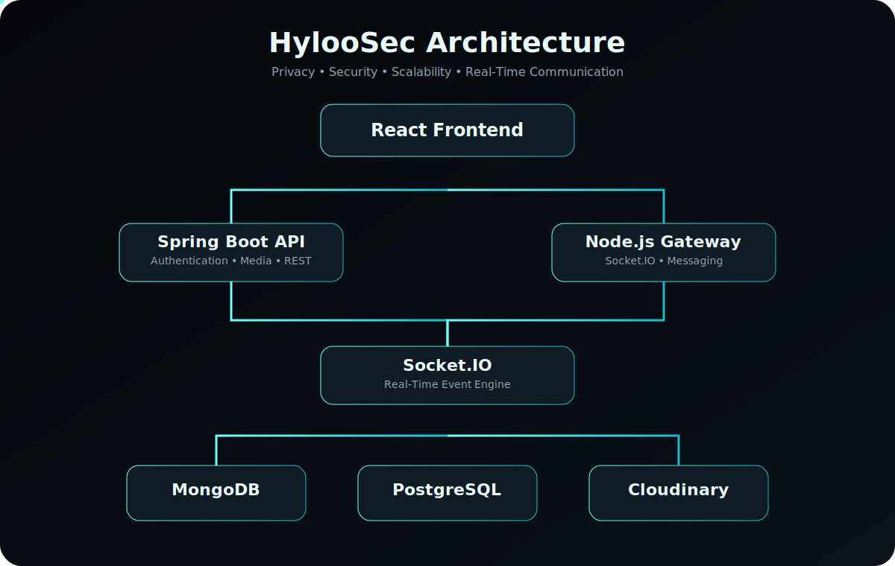

<!-- ========================================================= -->
<!--                     HYLOOSEC OFFICIAL                     -->
<!-- ========================================================= -->

<p align="center">


</p>

<h1 align="center">

HylooSec

</h1>

<h3 align="center">

Privacy First • Secure • Anonymous • Modern Communication Platform

</h3>

<p align="center">


</p>

---

<p align="center">

<a href="https://www.hyloosec.online">


</a>

<a href="https://github.com/hyloosec-official-creator/hyloosec-documentation">


</a>

<a href="https://github.com/hyloosec-official-creator">


</a>

</p>

---

<p align="center">


</p>

<p align="center">


</p>

# About HylooSec

> **HylooSec is a next-generation privacy-first communication platform designed to provide secure, fast and reliable real-time messaging without relying on traditional phone numbers or email addresses.**

Unlike conventional messaging applications, HylooSec introduces a **User ID based identity system** where users communicate through a unique numeric identifier instead of exposing personal contact information.

Every design decision is guided by four principles:

- 🛡 Privacy
- ⚡ Performance
- 🌍 Scalability
- 💎 Simplicity

HylooSec combines modern frontend technologies with dedicated backend services, secure authentication, real-time communication and cloud-based media delivery to create a messaging platform that is both powerful and easy to use.

---

## Vision

Our vision is to redefine digital communication by giving users complete control over their identity and conversations.

We believe privacy should not be treated as a premium feature—it should be the default experience.

---

## Mission

Our mission is simple:

> Build one of the world's most secure, privacy-focused and developer-friendly communication platforms.

Every feature added to HylooSec is evaluated through three questions:

- Does it improve user privacy?
- Does it improve security?
- Does it improve user experience?

If the answer is **No**, the feature is reconsidered before implementation.

<p align="center">


</p>
# Why HylooSec?

Modern communication platforms have become increasingly dependent on personal identifiers such as **phone numbers** and **email addresses**. While these methods simplify account recovery and user discovery, they also expose unnecessary personal information.

HylooSec was created to challenge this traditional approach.

Instead of treating personal information as the primary identity, HylooSec introduces a unique **User ID–based communication system** where users interact without exposing their phone number or email address during normal messaging.

Our objective is to reduce unnecessary personal data exposure while maintaining a fast, modern and reliable communication experience.

---

## The Problem

Most messaging platforms require users to provide personal contact information before they can even create an account.

Common requirements include:

- Phone Number
- Email Address
- OTP Verification
- Contact Synchronization
- Address Book Upload
- Continuous Identity Exposure

Although these methods are common, they also increase the amount of personal information shared across multiple online services.

HylooSec follows a different direction.

---

## The HylooSec Approach

HylooSec replaces traditional identity-based communication with a unique platform identity.

Every registered account receives:

- Unique Numeric User ID
- Personal Chat Security
- Private Authentication
- Secure Messaging Identity

Instead of searching users by personal contact information, communication is centered around the HylooSec User ID.

This creates a cleaner separation between platform identity and personal identity.

---

# Core Principles

HylooSec is built around four engineering principles.

---

## 🛡 Privacy First

Privacy is considered during every design decision.

Examples include:

- User ID based communication
- Independent chat security
- Dynamic documentation
- Minimal exposure of personal information
- Secure authentication flow

Privacy is not treated as an optional feature.

It is considered part of the platform architecture.

---

## ⚡ Performance

A communication platform should feel instant.

HylooSec focuses on:

- Real-time Socket.IO communication
- Lightweight frontend architecture
- Optimized rendering
- Fast message synchronization
- Efficient media loading
- Reduced unnecessary API requests

The objective is to provide a responsive messaging experience even as the platform grows.

---

## 🔒 Security

Security extends beyond login screens.

HylooSec incorporates multiple layers of protection throughout the application.

Current architecture includes:

- Secure authentication
- Chat security validation
- Password protection
- Security questions
- Encrypted chat access
- Protected messaging flow

Security improvements continue to evolve with each release.

---

## 🌍 Scalability

Applications should not only work today—they should also be capable of supporting future growth.

HylooSec has been designed with scalability in mind by separating responsibilities across dedicated services.

Examples include:

- Independent frontend
- Dedicated authentication services
- Dedicated messaging gateway
- Real-time Socket.IO communication
- Modular documentation system
- Cloud media storage

This modular architecture makes future expansion significantly easier.

---

# Design Philosophy

Good software should be powerful without becoming complicated.

HylooSec focuses on keeping the interface clean while hiding technical complexity behind the scenes.

The application is designed to provide:

- Simple navigation
- Fast learning curve
- Minimal distractions
- Consistent user experience
- Responsive layouts
- Modern visual design

Users should spend their time communicating—not learning how to use the application.

---

# What Makes HylooSec Different?

| Traditional Messaging | HylooSec |
|------------------------|----------|
| Phone Number Based | User ID Based |
| Email Dependent | No Email Required |
| Personal Contact Sharing | Platform Identity |
| Traditional Authentication | Multi-layer Authentication |
| Generic Documentation | Dynamic JSON Documentation |
| Static Help Pages | Server-rendered Documentation |
| Basic Messaging | Real-time Messaging Architecture |
| Monolithic Documentation | Modular Documentation System |

---

# Engineering Philosophy

The platform follows a simple engineering rule.

> **Every feature must improve at least one of the following:**

- Privacy
- Security
- Performance
- User Experience
- Maintainability

If a feature does not improve any of these areas, it is reviewed before implementation.

This philosophy helps keep the project focused while avoiding unnecessary complexity.

<p align="center">


</p>
# Platform Features

HylooSec is designed as a modern communication platform that combines privacy, security and performance without sacrificing user experience.

Every feature is developed with the objective of keeping communication simple while maintaining complete control over user identity.

---

# Secure Account Creation

Creating an account on HylooSec is designed to be straightforward while providing multiple security layers.

Unlike many traditional platforms, HylooSec does not require a phone number or email address during standard account creation.

Every user creates a unique platform identity by providing:

- Display Name
- Father's Name
- Personal Bio
- Date of Birth
- Chat Security Method
- Security Question
- Password

After successful registration, HylooSec automatically generates:

- Unique User ID
- Login Credentials
- Personal Information PDF

The generated PDF should be stored safely because it contains important account information required for future access.

---

# Secure Login

Logging into HylooSec requires only:

- User ID
- Password

After successful authentication, users must verify their selected Chat Security method.

Depending on the method selected during account creation, users either:

- Enter their security key

or

- Upload their encrypted key file

Only after successful verification is access granted.

A successful login session remains active for up to **7 days**, after which users are required to authenticate again.

This additional verification helps protect conversations even if login credentials become compromised.

---

# Password Recovery

If users forget their password, HylooSec provides a secure recovery workflow.

Password recovery requires:

- User ID
- Date of Birth
- Security Question
- Security Answer

Only after successful verification can a new password be created.

The recovery process updates only the password.

Other account information remains unchanged.

---

# Real-Time Messaging

HylooSec provides real-time messaging powered by Socket.IO.

Messages are exchanged instantly between connected users while maintaining synchronization across multiple application components.

Supported messaging features include:

- Instant delivery
- Automatic synchronization
- Typing indicators
- Delivery confirmation
- Seen confirmation
- Timestamp tracking

The messaging system is designed to remain responsive even during continuous conversations.

---

# Message Status System

Every outgoing message follows a complete delivery lifecycle.

```text
Sending
   │
   ▼
Sent
   │
   ▼
Delivered
   │
   ▼
Seen
```

These states help users understand the delivery progress of every message in real time.

---

# Conversation Sidebar

The conversation sidebar provides quick access to active chats.

Each conversation displays:

- User Name
- Last Message
- Last Message Timestamp
- Online Status
- Last Seen

The sidebar updates dynamically as new conversations become active.

> **Development Note:** Conversation preview synchronization continues to receive improvements as the platform evolves.

---

# User Profile

Selecting a conversation header opens the user's profile.

Profile information includes:

- Name
- Bio
- User ID
- Account Information

This allows users to verify the identity of the person they are communicating with.

---

# Media Sharing

HylooSec supports sending multiple files within a single message.

Supported capabilities include:

- Images
- Videos
- PDF Documents
- General Files

Multiple files can be selected simultaneously before sending.

Media previews are displayed before transmission to help users verify attachments.

---

# Emoji Support

HylooSec includes an integrated emoji picker.

Users can insert emojis directly into conversations while composing messages.

Emoji rendering is fully synchronized between sender and receiver.

---

# Long Message Support

The message editor supports large text input.

Messages containing long paragraphs are automatically handled by the interface.

For improved readability, lengthy messages display a **"More"** option allowing users to expand the complete content.

---

# Find User

Users can search for another HylooSec user using their unique **10-digit User ID**.

The Find User dialog displays:

- Name
- Bio
- Message Button

If no account matches the entered User ID, an appropriate message is shown.

Selecting **Message** automatically creates a conversation if one does not already exist.

Otherwise, the existing conversation opens immediately.

---

# Settings

The Settings page provides account management options.

Current functionality includes:

- Logged-in User Information
- Theme Selection
- Logout

Users can switch between Dark Mode and Light Mode without affecting account data.

---

# Dynamic Documentation

HylooSec documentation is maintained separately from the main application.

Documentation is stored as structured JSON files and rendered dynamically by the frontend.

```text
GitHub Repository
        │
        ▼
JSON Documentation
        │
        ▼
React Frontend
        │
        ▼
Rendered Documentation
```

This architecture enables documentation updates without requiring application redeployment.

---

# Responsive Experience

HylooSec is designed to provide a consistent experience across desktop and mobile devices.

Current interface optimizations include:

- Responsive Layout
- Adaptive Sidebar
- Mobile Navigation
- Desktop Chat Layout
- Modern UI Components

---

# Continuous Development

HylooSec continues to evolve through continuous improvements in:

- Performance
- User Experience
- Security
- Documentation
- Scalability

New functionality is introduced only after maintaining compatibility with the platform's core principles.

<p align="center">


</p>
# Security Architecture

Security is one of the primary design goals of HylooSec.

Instead of treating security as a single login process, HylooSec applies multiple verification layers throughout the user journey.

The platform separates account authentication, chat security and session validation into independent responsibilities to reduce the impact of a single point of failure.

---

# Authentication Workflow

Access to the platform is completed in multiple stages.

```text
User
   │
   ▼
Enter User ID
   │
   ▼
Enter Password
   │
   ▼
Account Verification
   │
   ▼
Chat Security Verification
   │
   ▼
Secure Session Created
   │
   ▼
Access Granted
```

Authentication is considered successful only after all required verification steps have been completed.

---

# User Identity

HylooSec identifies every account using a unique numeric User ID.

Unlike traditional communication platforms, users normally communicate through this platform identity instead of exposing personal contact information.

Each account contains:

- Unique User ID
- Display Name
- User Bio
- Account Information
- Chat Security Configuration

The User ID remains the primary identifier across the platform.

---

# Password Protection

Passwords are required for account authentication.

Password verification occurs before users can access protected areas of the application.

If verification fails:

- Login is denied.
- Protected resources remain inaccessible.
- Chat data is not unlocked.

Password recovery requires additional verification before a new password can be created.

---

# Chat Security Layer

After successful account authentication, HylooSec performs a second verification step.

This layer protects access to conversations.

Depending on the configuration selected during account creation, users may verify access by:

- Entering their security key

or

- Uploading their encrypted key file.

Only after successful verification is the messaging interface unlocked.

This additional layer helps separate account authentication from conversation access.

---

# Session Management

After successful authentication and chat-security verification, HylooSec creates an authenticated session.

Current session behavior includes:

- Successful login session
- Secure access to conversations
- Session expiration after approximately seven days
- Re-authentication after session expiry

This approach reduces the need for repeated logins while ensuring periodic verification.

---

# Forgot Password Security

Password recovery follows a controlled verification process.

Users must provide:

- User ID
- Date of Birth
- Security Question
- Security Answer

Only after successful verification can a new password be created.

This workflow reduces the likelihood of unauthorized password changes.

---

# Conversation Security

Conversation access is restricted to authenticated users.

Only users who successfully complete authentication and chat-security verification can access protected messaging areas.

Conversation operations include:

- Reading messages
- Sending messages
- Uploading files
- Viewing media
- Viewing user information

These actions occur only within an authenticated session.

---

# File Handling

HylooSec supports sharing multiple files within conversations.

Before transmission, users can review selected files.

Supported categories include:

- Images
- Videos
- PDF Documents
- General Attachments

This review process helps reduce accidental uploads.

---

# User Privacy

HylooSec is designed to minimize unnecessary exposure of user information.

Examples include:

- User ID–based communication
- Independent chat security
- No phone number required during standard account creation
- No email address required during standard account creation
- Dynamic documentation separated from the main application

Privacy considerations influence both application design and future feature development.

---

# Security Principles

Every security-related feature is evaluated using the following principles.

## Authentication

Only verified users should gain access to protected resources.

---

## Authorization

Authenticated users should access only the resources available to them.

---

## Privacy

Personal information should be exposed only when required by the application.

---

## Simplicity

Security should remain understandable for users without reducing protection.

---

## Maintainability

Security-related components should remain modular and easy to improve as the platform evolves.

---

# Security Roadmap

Future security improvements may include:

- Enhanced account verification
- Additional authentication options
- Expanded session controls
- Improved device management
- Advanced login activity visibility
- Continued security hardening

As the platform evolves, security features will continue to be reviewed and refined while maintaining compatibility with existing user workflows.

<p align="center">


</p>
# Technology Stack

HylooSec is built using a modular technology stack where every technology has a dedicated responsibility.

Instead of relying on a single backend, the platform separates authentication services, real-time communication and media handling into specialized components.

This approach improves maintainability, scalability and future development.

---

# Frontend Architecture

The frontend is developed using **React.js** and follows a component-based architecture.

React enables the application to update only the required parts of the interface instead of reloading entire pages.

Key responsibilities include:

- User Authentication
- Chat Interface
- Sidebar
- User Search
- Settings
- Media Preview
- Responsive Layout
- Dynamic Documentation Rendering

The frontend is bundled using **Vite**, providing fast development builds and optimized production output.

---

## State Management

Application-wide state is managed using **Redux Toolkit**.

Redux provides a predictable state container that simplifies communication between different parts of the application.

Current state modules include:

- Authentication
- User Information
- Active Chat
- Conversation Sidebar
- Selected Files
- UI Preferences

This structure keeps application logic organized while reducing unnecessary component re-rendering.

---

# Backend Services

HylooSec uses dedicated backend services instead of placing all logic into a single application.

This separation allows each service to focus on a specific responsibility.

Current backend responsibilities include:

- User Authentication
- Account Management
- Real-Time Messaging
- Conversation Management
- File Upload Handling
- Documentation Delivery

This modular approach simplifies maintenance and future expansion.

---

# Spring Boot Services

Spring Boot powers the core account-related services.

Responsibilities include:

- Login
- Account Creation
- Password Recovery
- User Verification
- REST APIs

Spring Boot is used because of its mature ecosystem, strong security support and enterprise-grade architecture.

---

# Node.js Messaging Gateway

Real-time communication is handled by a dedicated Node.js service.

Primary responsibilities include:

- Socket.IO Communication
- Message Delivery
- Typing Indicators
- Conversation Updates
- User Presence
- Online Status
- Last Seen Synchronization

Separating messaging into an independent service reduces coupling with authentication logic.

---

# Real-Time Communication

Socket.IO enables bidirectional communication between connected users.

Current event types include:

- Join Chat
- Send Message
- Receive Message
- Typing Status
- Delivery Status
- Seen Status
- User Presence Updates

Socket.IO provides the foundation for instant messaging throughout the application.

---

# Database Architecture

HylooSec uses multiple storage technologies, allowing different data types to be stored where they fit best.

---

## MongoDB

MongoDB stores highly dynamic communication data.

Examples include:

- Conversations
- Messages
- User Presence
- Chat Metadata

The document model makes MongoDB well suited for rapidly changing messaging data.

---

## PostgreSQL

PostgreSQL manages structured application data.

Typical responsibilities include:

- User Accounts
- Authentication Data
- Structured Business Logic

Relational storage provides consistency for account-related operations.

---

# Media Storage

Media files are stored separately from application databases.

Cloudinary is used for handling media uploads and delivery.

Supported media includes:

- Images
- Videos
- PDF Documents
- Attachments

Separating media storage improves scalability and reduces database load.

---

# Documentation Architecture

HylooSec documentation is maintained independently from the main application.

```text
Documentation Repository
        │
        ▼
JSON Files
        │
        ▼
GitHub Hosting
        │
        ▼
React Fetch Request
        │
        ▼
Dynamic Documentation Rendering
```

This architecture allows documentation updates without rebuilding or redeploying the application.

Benefits include:

- Faster updates
- Easier maintenance
- Independent version control
- Reduced application size

---

# Deployment Strategy

The platform separates frontend and backend deployment.

Current deployment responsibilities include:

Frontend

- React Application
- Static Assets

Backend

- Authentication Service
- Messaging Service
- API Endpoints

Supporting Services

- Database
- Cloud Storage

Keeping these services independent improves operational flexibility.

---

# Engineering Decisions

Several architectural decisions guide the development of HylooSec.

## Modular Design

Each service performs a dedicated responsibility.

Benefits:

- Easier maintenance
- Cleaner code
- Independent improvements

---

## Separation of Concerns

Authentication, messaging and documentation remain logically independent.

Benefits:

- Better scalability
- Reduced complexity
- Easier debugging

---

## Component-Based Frontend

Reusable React components improve consistency across the application.

Benefits:

- Cleaner UI
- Faster development
- Better maintainability

---

## Real-Time First Design

Messaging is designed around live communication rather than periodic polling.

Benefits:

- Faster updates
- Reduced latency
- Better user experience

---

## Dynamic Documentation

Documentation is loaded when required instead of being bundled into the application.

Benefits:

- Smaller application size
- Faster updates
- Independent documentation releases

---

# Scalability Strategy

HylooSec has been designed with future growth in mind.

Current architecture supports gradual expansion by allowing individual services to evolve independently.

Future improvements may include:

- Additional backend services
- Expanded media capabilities
- New authentication methods
- Improved monitoring
- Additional deployment environments

The overall objective is to build a platform that remains maintainable as the project grows.

<p align="center">


</p>
# System Architecture

HylooSec follows a modular architecture where each layer has a dedicated responsibility.

Instead of placing every feature inside a single backend service, the platform separates user authentication, messaging, storage and documentation into independent modules.

This architecture improves maintainability, scalability and future expansion.

<p align="center">



</p>

---

# High-Level Architecture

```text
                     User
                      │
                      ▼
        React + Redux Frontend
                      │
      ┌───────────────┼────────────────┐
      │               │                │
      ▼               ▼                ▼
Spring Boot      Node.js Gateway   Documentation
Authentication     Socket.IO          JSON Files
      │               │                │
      │               ▼                ▼
      │        Real-Time Events   GitHub Repository
      │
      ├───────────────┐
      ▼               ▼
 PostgreSQL       MongoDB
      │               │
      └───────────────┘
              │
              ▼
         Cloudinary
```

Every component communicates only with the services it requires.

This reduces unnecessary coupling between application layers.

---

# Client Request Flow

Every request begins at the React frontend.

```text
User Action
      │
      ▼
React Component
      │
      ▼
Redux Action
      │
      ▼
API / Socket Event
      │
      ▼
Backend Service
      │
      ▼
Database
      │
      ▼
Response
      │
      ▼
Redux Store
      │
      ▼
React UI Update
```

This predictable flow keeps application state synchronized across the interface.

---

# Authentication Flow

```text
User

│

▼

User ID

│

▼

Password

│

▼

Spring Boot Authentication

│

▼

Authentication Success

│

▼

Chat Security Verification

│

▼

Secure Session Created

│

▼

React Dashboard
```

Authentication completes before protected resources become available.

---

# Chat Initialization

When a user opens a conversation, the following workflow occurs.

```text
Open Conversation

│

▼

Load Conversation

│

▼

Fetch Previous Messages

│

▼

Update Sidebar

│

▼

Mark Messages as Seen

│

▼

Render Chat Window
```

This ensures the conversation remains synchronized with the latest message state.

---

# Real-Time Message Flow

The messaging system is powered by Socket.IO.

```text
Sender

│

▼

Compose Message

│

▼

Socket.IO Event

│

▼

Node.js Gateway

│

▼

Save Message

│

▼

MongoDB

│

▼

Receiver Connected?

│

├───────────────┐

│ Yes           │ No

▼               ▼

Deliver      Store

│               │

▼               ▼

Seen Later    Delivered Later
```

The gateway manages message delivery while keeping both users synchronized.

---

# Message Lifecycle

Every outgoing message progresses through a defined lifecycle.

```text
Compose

↓

Sending

↓

Sent

↓

Delivered

↓

Seen
```

Each state is synchronized with both the sender and recipient.

---

# Online Presence

HylooSec continuously tracks user availability.

```text
User Connected

↓

Socket Connected

↓

Status = Online

↓

Conversation Updated

↓

User Disconnects

↓

Status = Last Seen
```

This allows conversations to display accurate online and last-seen information.

---

# File Upload Flow

Media uploads follow a dedicated workflow.

```text
Choose Files

↓

Preview Files

↓

Upload Request

↓

Backend Validation

↓

Cloudinary Upload

↓

Database Update

↓

Message Created

↓

Receiver Receives Media
```

Separating media storage from database storage improves scalability.

---

# Database Responsibilities

Different storage technologies are used according to the type of information being stored.

## MongoDB

Stores:

- Messages
- Conversations
- Presence Information
- Chat Metadata

MongoDB is optimized for dynamic messaging data.

---

## PostgreSQL

Stores:

- User Accounts
- Authentication Data
- Structured Application Information

Relational storage ensures consistency for account management.

---

## Cloudinary

Stores:

- Images
- Videos
- Documents
- Attachments

Media remains separate from application databases, reducing storage complexity.

---

# Documentation Flow

HylooSec documentation is intentionally separated from the main application.

```text
GitHub Repository

↓

Documentation JSON

↓

React Fetch

↓

Server Rendering

↓

Documentation Page

↓

User
```

Advantages include:

- Faster documentation updates
- Independent version control
- Smaller application bundle
- Easier maintenance

---

# Sidebar Synchronization

Whenever new activity occurs, the conversation sidebar is refreshed.

Current synchronized information includes:

- User Name
- Last Message
- Timestamp
- Online Status
- Last Seen

> **Development Note:** Conversation preview synchronization continues to be refined as the messaging system evolves.

---

# Responsive Rendering

The interface automatically adapts according to screen size.

Desktop Layout

- Sidebar
- Chat Window
- User Information

Mobile Layout

- Full-screen Conversation
- Responsive Navigation
- Optimized Controls

This allows the same application to provide a consistent experience across different devices.

---

# Deployment Overview

HylooSec is deployed using independent services.

```text
React Frontend

↓

Reverse Proxy

↓

Spring Boot APIs

↓

Node.js Gateway

↓

Databases

↓

Cloud Storage
```

Separating responsibilities simplifies maintenance and allows individual services to scale independently.

---

# Architecture Goals

Every architectural decision supports one or more of the following objectives.

- Privacy
- Security
- Performance
- Scalability
- Maintainability
- Reliability
- User Experience

These goals guide both current implementation and future platform development.

<p align="center">


</p>
# Official Repositories

HylooSec is developed as a collection of independent repositories.

This approach keeps the project organized while allowing every module to evolve independently.

| Repository | Description | Status |
|------------|-------------|--------|
| **HylooSec** | Main communication platform | 🟢 Active |
| **HylooSec Documentation** | JSON-powered documentation center | 🟢 Active |
| **HylooSec Official Profile** | GitHub profile assets and branding | 🟢 Active |

---

# Documentation Center

HylooSec documentation is completely independent from the application.

Instead of embedding documentation inside the frontend source code, every document is maintained as structured JSON.

```text
hyloosec-documentation

manifest.json

user-manual/

features/

about/

privacy/

faq/

terms/

troubleshooting/

assets/
```

Benefits of this architecture include:

- Independent documentation updates
- Smaller application bundle
- Easier maintenance
- Better version control
- Dynamic rendering
- Search-engine friendly documentation routes

---

# Development Workflow

The HylooSec development workflow follows a structured process.

```text
Requirement

↓

Planning

↓

Architecture

↓

Development

↓

Testing

↓

Documentation

↓

Deployment

↓

Maintenance
```

Every feature follows this lifecycle before reaching production.

---

# Development Principles

HylooSec follows several engineering principles.

## Clean Code

Readable code is preferred over complicated code.

---

## Modular Design

Every module should have one primary responsibility.

---

## Performance First

Performance improvements are considered throughout development rather than after implementation.

---

## Privacy by Design

Privacy is considered during feature planning rather than being added later.

---

## Continuous Improvement

Every release should improve one or more of:

- Performance
- Security
- Privacy
- Scalability
- User Experience

---

# Project Roadmap

The platform continues to evolve.

Current roadmap includes:

## Completed

- Secure Account System
- User ID Authentication
- Real-Time Messaging
- File Sharing
- Emoji Support
- Find User
- Settings
- Dynamic Documentation
- Responsive Interface
- JSON Documentation Platform

---

## In Progress

- Conversation Improvements
- Sidebar Synchronization
- Documentation Expansion
- Performance Optimization

---

## Planned

- Group Conversations
- Voice Calling
- Video Calling
- Desktop Application
- Progressive Web App Improvements
- AI-assisted Features
- Enhanced Notification System
- Additional Security Layers

---

# Contribution Guidelines

Contributions are welcome.

Before submitting changes:

- Follow project coding standards.
- Keep commits focused.
- Document new features.
- Test functionality before submitting.
- Maintain compatibility with the existing architecture.

Quality is preferred over quantity.

---

# Project Goals

The long-term objective of HylooSec is to become a modern communication platform that combines:

- Privacy
- Performance
- Reliability
- Simplicity
- Security
- Scalability

while remaining easy to use for everyone.

---

# Connect With HylooSec

🌐 Official Website

https://www.hyloosec.online

📚 Documentation

https://github.com/hyloosec-official-creator/hyloosec-documentation

💻 GitHub

https://github.com/hyloosec-official-creator

---

# GitHub Activity

<p align="center">


</p>

---

# Contribution Snake

<p align="center">

<picture>

<source media="(prefers-color-scheme: dark)"
srcset="https://raw.githubusercontent.com/hyloosec-official-creator/hyloosec-official-creator/output/github-contribution-grid-snake-dark.svg">


</picture>

</p>

---

# Acknowledgements

HylooSec is the result of continuous learning, experimentation and iterative development.

Every release represents another step toward building a secure, privacy-first communication platform.

---

# License

This repository is provided for educational, demonstration and project development purposes.

Please refer to the repository license for complete usage terms.

---

<p align="center">


</p>

<h2 align="center">

HylooSec

</h2>

<p align="center">

<strong>Privacy First Communication</strong>

</p>

<p align="center">

Secure • Modern • Reliable • Scalable

</p>

<p align="center">

Made with ❤️ for developers, learners and privacy-conscious users.

</p>

---

<p align="center">

⭐ If you like the project, consider giving it a star.

</p>

<p align="center">

Thank you for visiting the official HylooSec GitHub profile.

</p>
